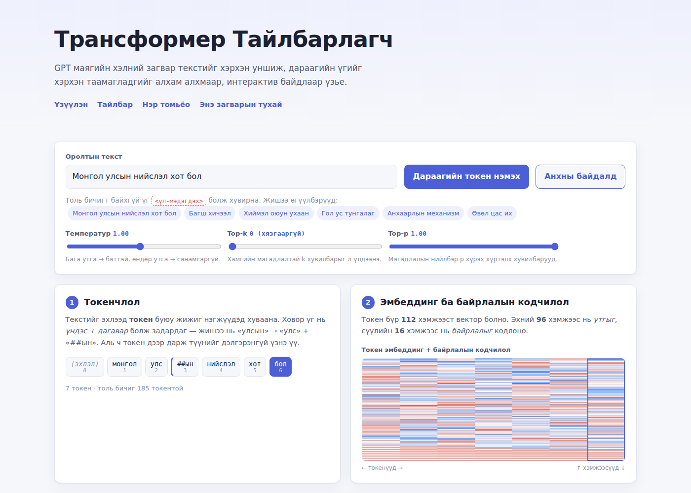

# Трансформер Тайлбарлагч

GPT маягийн трансформер хэлний загвар хэрхэн ажилладгийг **монгол хэл дээр**
алхам алхмаар харуулсан интерактив үзүүлэн. Хамаарал байхгүй, сан ашиглаагүй,
бүх тооцоолол таны хөтөч дээр хийгдэнэ.



## Юу харуулдаг вэ?

| Алхам | Агуулга |
|---|---|
| 1. Токенчлол | Текстийг токен болгон хуваах, ховор үгийг «үндэс + дагавар» болгон задлах |
| 2. Эмбеддинг | Токен бүрийн 112 хэмжээст вектор ба синусоид байрлалын кодчилол |
| 3. Трансформер блок | LayerNorm → Q/K/V → олон толгойт анхаарал → үлдэгдэл → MLP (GELU) → үлдэгдэл |
| 4. Гаралт | Логит → температур → софтмакс → дараагийн токены магадлал |

Интерактив боломжууд:

- Дурын **монгол текст** оруулах, эсвэл бэлэн жишээ сонгох
- Токен дээр дарж түүний **Q, K, V вектор** болон анхаарлын мөрийг үзэх
- **4 блок × 4 анхаарлын толгой** хооронд шилжих
- **Температур, top-k, top-p** параметрийг шууд тохируулах
- «Дараагийн токен нэмэх» товчоор алхам алхмаар текст үүсгэх
- Дулааны зураглалын нүд бүр дээр хулгана аваачиж тоон утгыг харах

Анхаарлын дөрвөн толгой нь бодит загварт ажиглагддаг хэв маягуудыг харуулна:
**өмнөх токен**, **эхний токен** (attention sink), **утгын төстэй байдал**,
**холимог хэв маяг**.

## Ажиллуулах

Ямар ч суулгац шаардлагагүй — `index.html` файлыг хөтчөөр нээхэд хангалттай.

Эсвэл дотоод сервер ашиглаж болно:

```bash
python3 serve.py          # http://localhost:8000
python3 serve.py 8080     # өөр порт
```

## Сорилууд

```bash
node tests/model.test.js     # загварын математик (31 шалгуур)
node tests/browser.test.js   # хөтөч дээрх интеграци (Playwright шаардана, 30 шалгуур)
```

`model.test.js` нь LayerNorm-ийн статистик, софтмаксын нийлбэр, шалтгаант маск,
анхаарлын толгойн зан төлөв, температурын нөлөө, top-k/top-p шүүлт, тодорхой
байдал (determinism) зэргийг шалгана.

## Файлын бүтэц

```
index.html              бүх агуулга ба тайлбар бичвэр
assets/css/style.css    хэв маяг (гэрэл/бараан горим, гар утсанд тохирсон)
assets/js/corpus.js     монгол корпус, токенчлогч, толь бичиг байгуулалт
assets/js/model.js      PPMI эмбеддинг, анхаарал, MLP, урагш дамжлага
assets/js/viz.js        canvas дулааны зураглал, SVG анхаарлын матриц
assets/js/app.js        интерфэйс, төлөв, үйл явдлын холболт
tests/                  сорилууд
serve.py                хөгжүүлэлтийн статик сервер
```

## Энэ загварын тухай (чухал)

Энэ хуудсан дээрх загвар нь **GPT-2 биш**, харин сурах зорилгоор бүтээсэн жижиг
**үзүүлэн загвар** юм:

- Бүх матрицын үйлдэл — эмбеддинг, байрлалын кодчилол, LayerNorm, олон толгойт
  анхаарал, шалтгаант маск, GELU бүхий MLP, үлдэгдэл холболт, софтмакс —
  **бодитоор тооцоологддог**. Энэ бол хуурамч анимаци биш.
- Харин жингүүд нь градиент буурлалтаар **сургагдаагүй**. Эмбеддинг ба зайлуулах
  матрицыг жижиг корпусын хамт тохиолдлын статистикаас (PPMI) байгуулж,
  санамсаргүй проекцоор шахсан. Анхаарлын толгойнуудыг тайлбарлахад хялбар
  байхаар зориудаар зохион байгуулсан.
- Иймд таамаглал нь голчлон сүүлийн хэдэн токенд тулгуурладаг бөгөөд бодит
  хэлний загварын чадварыг илэрхийлэхгүй. Зорилго нь **үр дүн** биш,
  **механизм**-ыг үнэн зөв харуулах явдал юм.
- Толь бичиг ердөө ~185 токентой (GPT-2 нь 50 257).

## Хэмжээ ба тохиргоо

| Параметр | Утга | GPT-2 small |
|---|---|---|
| d_model | 112 (96 утга + 16 байрлал) | 768 |
| Анхаарлын толгой | 4 | 12 |
| Толгойн хэмжээс | 28 | 64 |
| Блокын тоо | 4 | 12 |
| MLP далд давхарга | 448 | 3072 |
| Толь бичиг | ~185 | 50 257 |

Эдгээрийг `assets/js/model.js` доторх `CFG` объектоос өөрчилж болно.

## Эх сурвалж ба талархал

Санаа нь Georgia Tech-ийн Polo Club of Data Science багийн
[Transformer Explainer](https://poloclub.github.io/transformer-explainer/)
төслөөс сэдэвлэсэн. Энд байгаа код, бичвэр, загвар нь бүхэлдээ бие даан,
монгол хэлээр шинээр бичигдсэн — тухайн төслийн эх кодыг хуулаагүй болно.

Архитектурын үндэс: Vaswani нар (2017), *Attention Is All You Need*.

## Лиценз

MIT — дэлгэрэнгүйг [LICENSE](LICENSE) файлаас үзнэ үү.
